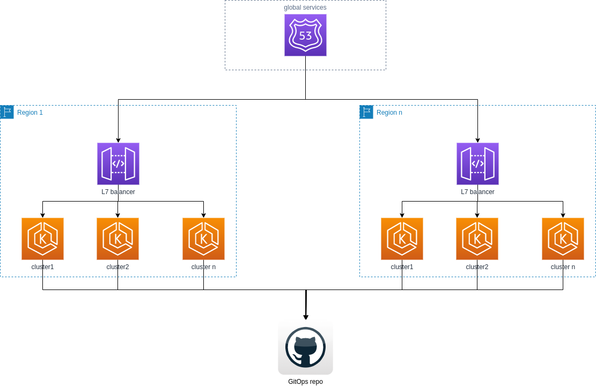
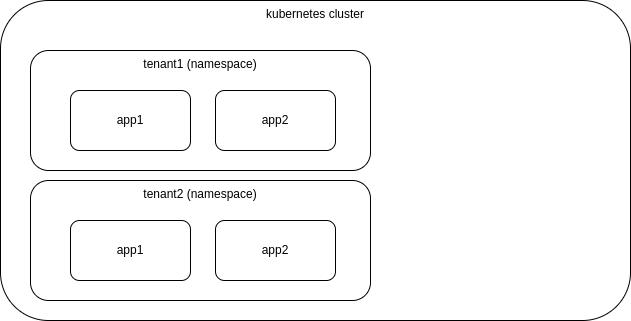
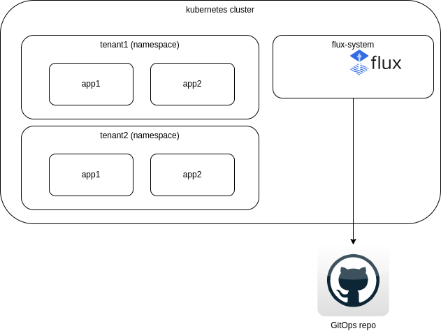
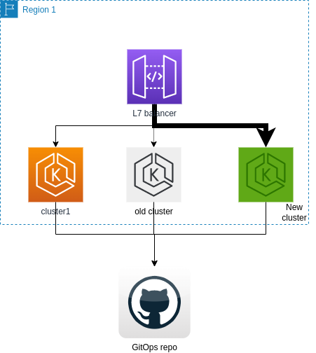

# k8s upgrade lab

## Architecture diagram

As stated in the requirements, the solution consists on a geographically distributed set of Kubernetes clusters hosted in AWS, even though there are no special dependencies on this cloud provider.



The traffic can be distributed to each region by a global balancing service (out of scope for this solution), and each region may have a Layer7 balancing service that distributes the workload among the available clusters  within the region.

Each cluster may host one or more tenants. A tenant represents marketplace and may contain one or more applications. Each tenant is mapped to a namespace in Kubernetes.



### Tools and technologies

#### GitOps

To maintain the tenants it was selected [Flux](https://fluxcd.io/docs/installation/) as a GitOps solution.

The advantages of this solution are:

* Each cluster will be responsible of its own deployment process, so if a cluster is not yet ready or it's being checked, the rest of the clusters will continue working.
* Once is ready to deploy, the process is fully automated. If the there are new deployments for a tenat, they will be deployed in the cluster normally.

The proposed solution for Flux considers the following:

* There is configuration specific for the cluster. It means, that when a new cluster is created, there is a set of configuration that is specific for that cluster. For example, the configuration of the ingress controller, the configuration of the load balancer, metrics, observality, etc. This configuration is stored in the `clusters` directory.
* There is a set of validation tests that are part of the deployment process. Some of them are:
  * Check that the ingress controller is working properly.
  * Check that the load balancer is working properly.
  * Check that the tenant is working properly.
* There is a git repository for each tenant. The purpose is avoid conflicts between different tenants. Each tenant is mapped to a namespace in Kubernetes.

The applications and components required for each tenant are defined as Helm charts and kustomize files.

#### Monitoring

Prometheus and Grafana are used for monitoring. The metrics are collected from the cluster and from the applications. The metrics are stored in a Prometheus database and are visualized in Grafana.

#### Istio

Istio is used as a service mesh used by Flux. It provides observability, security, traffic management and policy enforcement.

### Assumptions

* The services are stateless.
* When a tenant is being deployed, but not yet validated, all validation operations do not update tenant data, such as databases or storage.

## Upgrade process

1. Create the new cluster with target k8s version. No traffic is routed to this cluster.
2. Bootstrap flux in the new cluster. It will be configured the same git repository as the rest of the clusters.
3. There is a configuration specific to the cluster. This configuration is applied first.
   1. The core configuration includes observability components.
   2. After deploying base cluster configuration there are validation tests.
4. Create a namespace for each tenant that will be deployed in the cluster.
5. Configure flux to deploy the tenant in the new namespace. Force the deployment of the tenant. The tenant deployment is performed using flagger, see [istio-system](./operators/istio-system/flagger-rules.yaml) for more details. Flagger is configured to
   1. Perform validation tests. In tests do not pass the process stops.
   2. Perform load tests. Verify that the results are in the expected range.
   3. It monitors the traffic and if there is an error it rolls back the deployment.
6. If there are new deployments during this process, the previous step will be repeated for each new deployment.

If there is an error on each of the steps the process will be stopped and the cluster will be deleted.

If there are new tenant deployments during this process they will be processed normally by flux. A tenant deployment consists in a new version in the observer git repository.

Once the new cluster is validated, it will be necessary to update the load balancer to route the traffic to the new cluster, and stop sending traffic to the old cluster. Once the traffic is routed to the new cluster, the old cluster can be deleted or kept during a period of time in case a rollback is necessary later.



## Metrics

Metrics are collected using prometheus and can be consumed with grafana. See [monitoring](./operations/manifests/base/monitoring/)

* Errors. The rate of requests that fail, mostly compared to the system that is running in the old cluster. 

* Latency. The requests should be processed in the same time or with a better performance than the old cluster.

* Resource consumption. The new cluster should consume the same or less resources than the old cluster.

## How to run this sample locally

### What do you need?

* [Docker](https://docs.docker.com/get-docker/)
* [k3d](https://k3d.io/v5.5.1/#installation)
* [flux](https://fluxcd.io/docs/installation/)
* Github account

This sample asumes that you have a k3d cluster running with the name `cluster1` and kubernetes version 1.26.4 and another one using named `cluster2` and kubernetes version 1.27.1.

### Deploy the sample

This sample assumes that the old cluster is named `cluster1`and the new cluster is named `cluster2`. The tenant name is `core`.

1. Open a shell and clone this repository.
```bash
git clone https://github.com/felipmiguel/gitops-demo-multitenant.git
```
The configuration for the tenant is located in `https://github.com/felipmiguel/gitops-demo-tenant-core.git`. It is recommended to fork this repository and use your own repository if you want to make changes.
2. Go to github and generate a PAT token. See [here](https://docs.github.com/en/github/authenticating-to-github/keeping-your-account-and-data-secure/creating-a-personal-access-token) for more details.
4. Define an environment variable with the PAT token.
```bash
export GITHUB_TOKEN=<edited>
```
If the environment variable is not defined, flux will ask for the token when it is executed.
5. Execute the following script to create the old cluster.
```bash
./create-cluster-local.sh cluster1 rancher/k3s:v1.25.10-k3s1
```
This script accepts several parameters:
* The name of the cluster. in the example is `cluster1`.
* The name of the tenant. The image to use to create the kubernetes cluster. In the example is `rancher/k3s:v1.25.10-k3s1`. This is not the most recent image available. The purpose is to simulate an old cluster.
* The environment of the cluster. If not provided assumes staging. Possible values are `staging` and `production`.
* location of the cluster. If not provided assumes `northeurope`. Possible values are `northeurope` and `westeurope`. This a parameter used to simulate a geographically distributed cluster, in case there are different configurations for each region. Usually there are dependencies on regional cloud resources, such as managed databases, storage, etc.
* server port. If not provided assumes `8080`. This is the port used to access the cluster. As there will be more than one cluster in the same machine, it is necessary to use different ports.
The script creates a cluster locally using k3d and bootstraps Flux.
6. Execute the following script to deploy the tenant in the old cluster.
```bash
./deploy-tenant-local.sh cluster1 core
```
After few moments the application tenant will be deployed performing all validation tests.
7. Execute the following script to create the new cluster.
```bash
./create-cluster-local.sh cluster2 rancher/k3s:latest staging northeurope 8081
```
That creates the second cluster, using the latest version of k3s and exposing the cluster in port 8081.
8. Execute the following script to deploy the tenant in the new cluster.
```bash
./deploy-tenant-local.sh cluster2 core
```

You can find all this steps in a single script [do-all.sh](./do-all.sh), except github token to avoid storing the token in the repository.

### Clean-up
You can delete the clusters using the following script.
```bash
./cleanup-local.sh
```